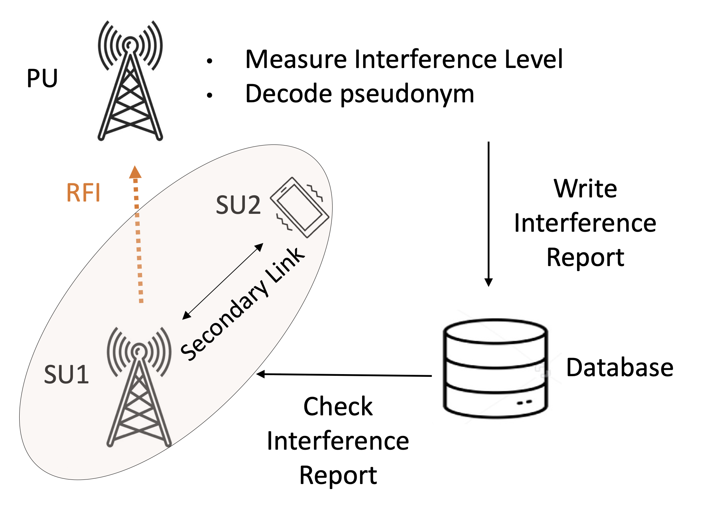
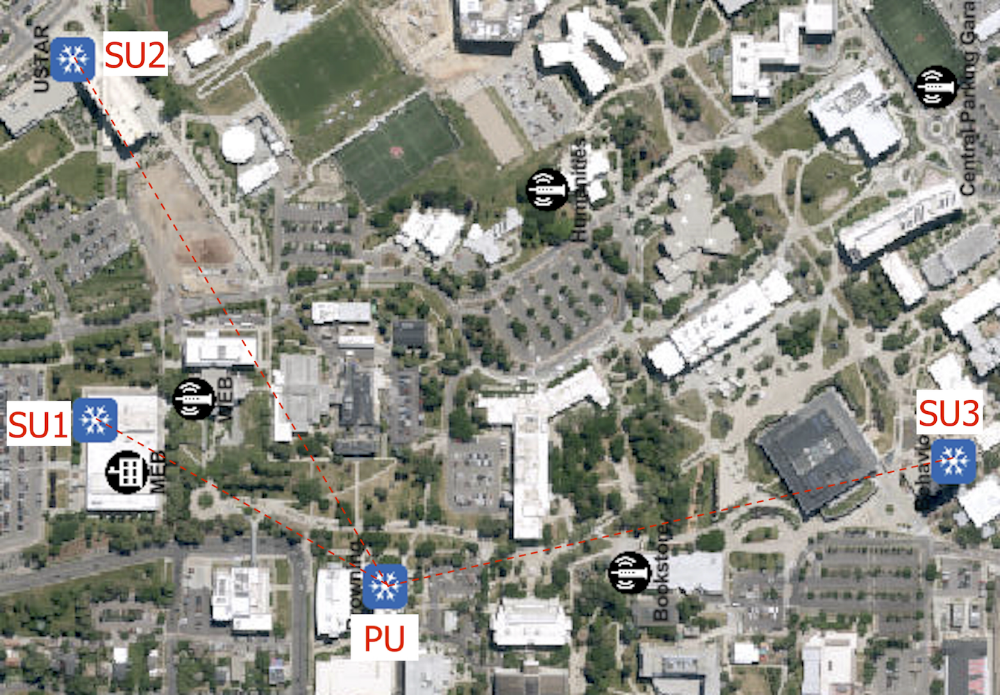

# StopSec: Real-Time Spectrum Sharing System

## Overview
This project implements a real-time wireless spectrum sharing system (StopSec) using SDR platforms. It detects and stops interfering users under low-SNR conditions using PHY-layer watermarking and a feedback control loop.

## My Contribution
- Designed PHY-layer watermarking and detection algorithms
- Implemented real-time SDR system using USRP (TX/RX pipelines)
- Developed interference detection and pseudonym decoding
- Integrated database-based feedback control loop
- Conducted over-the-air experiments under real conditions

## System Architecture


### Workflow
1. Secondary users (SU) transmit OFDM signals with embedded pseudonyms  
2. Primary user (PU) detects interference and decodes pseudonym  
3. PU writes interference report to database  
4. Secondary users query database and stop transmission if detected
   
## Experimental Setup

The system was deployed in a real-world wireless testbed environment using multiple SDR nodes.



### Setup Details
- Multiple secondary users (SU1, SU2, SU3) transmitting over the air  
- Primary user (PU) receiving and detecting interference  
- Distributed deployment across different physical locations  
- Real wireless channel conditions with multipath and interference  
## Technical Highlights
- OFDM-based waveform with subcarrier watermarking
- Correlation-based detection and synchronization
- Low-SNR signal detection
- Real-time SDR streaming and buffering

## Tools
- Python
- USRP (SDR)
- UHD API
- GNU Radio (if used)

## Key Results
- Interference stopping latency:
  - < 270 ms at SNR ≥ −8 dB
  - < 650 ms at −10 dB SNR
- Reliable detection below noise floor
- No degradation to communication link

### Pseudonym Detection Performance


- Reliable detection even at low SNR conditions
- Performance degrades gracefully under multiple interfering users

### Interference Mitigation Latency vs Bandwidth


- Faster stopping with higher bandwidth configurations
- Trade-off between packet duration and system response time

### Interference Mitigation with Multiple Users


- System successfully detects and stops multiple interfering users
- Increased number of users slightly increases stopping time
  
## Reproducibility
Instructions below.

This profile is intended for doing any experiment using StopSec. 
This experiment uses rooftop SDR nodes (USRP X310) and compute nodes from the Emulab cluster. 

**1) Instantiate this profile with appropriate parameters**

At the "Parameterize" step, add at least 2 rooftop radios in the CBRS band that are needed for your planned experiment. By default, one database server from the group d430 or d740 will be added. 
Also, speceify the freqeuncy ranges if you are planning to use transmitter(s) in your experiment. Also by default, all the nodes will be setup in one LAN. Try to ping from one node to the other to try if they are in the same LAN.
Once you have these parameters selected, click through the rest of the profile and then click "Finish" to instantiate.  It will take 10 to 15 minutes for the experiment to finish setting up.  Once it is "green", proceed to the next step.

**2) Setting up the experiment**
- once the experiment is ready, the database serever will be indicated on the list view. Other nodes will be indicated as rooftop nodes which the user has to choose. 
- select one of the rooftop nodes to be the primary user (PU)
- select at least one of the other rooftop nodes as the secondary user (SU)
- run the following command on each of the nodes
  ```
  ssh -Y <username>@<radio_hostname>
  ```
  
**3) Cloning StopSec to Each Node**
Run the following command on each node to clone StopSec repository to your nodes. 
  ```
git clone https://github.com/StopSec/StopSec-System.git
  ```
Run the following command on each node to move to the directory that contains the StopSec files.

  ```
cd StopSec-System
  ```

**4) Run Experiments**
1) Install unicorn using the following command. Do that on all of the nodes.
```
sudo apt install uvicorn python3-fastapi
```
2) Run the following command on the Database Server to start the remote database server api
```
uvicorn remote_api:app --host 0.0.0.0 --port 8080
```
3) open two terminals for each of the PU and SU nodes, and run the following command to start the local database api
```
uvicorn local_api:app --host 127.0.0.1 --port 8081
```
4) on the PU run the following command to start StopSec receive operation. 
```
python3 Watermark_RealTime_RX.py -f 3383e6 -r 5e6 -g 30
```
5) on each of the SU nodes start the transmission operation. Note that the start time is in 24 hour format. So, make sure to write when you want to start your experiment. Set the same time in all SUs if you want to see the impact of concurrent interference at the PU. Note also that these are default values. You can change the frequency, sampling rate and gains to see how StopSec performs under various signal-to-noise ratio (SNR), and bandwidth and frequencies. If you choose multiple concurrent SU transmissions, check the latency for the node that is turned off last. You can test for various SU and PU configurations and test the performance of StopSec under these configurations. 
```
python3 Watermark_RealTime_TX.py -f 3383e6 -r 5e6 -g 20 --start_time 6:30
```
6) Record values evaluate the StopSec system. 


